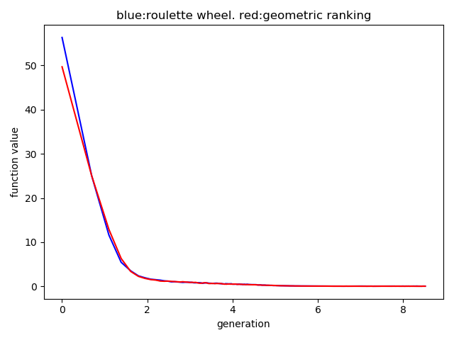
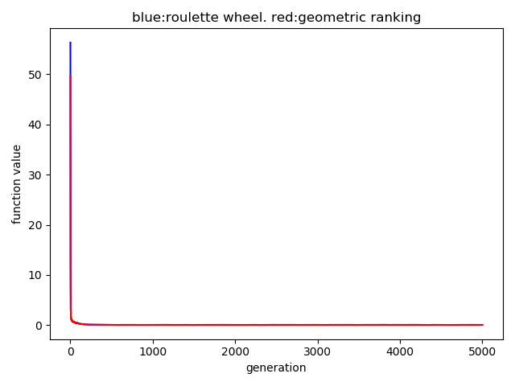
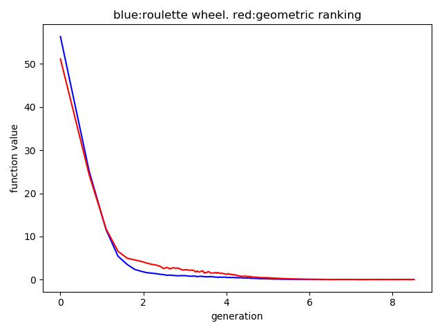
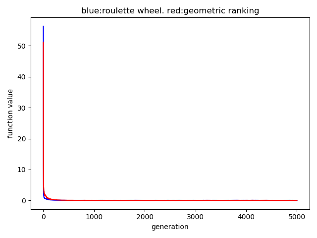
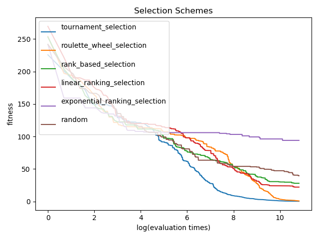

# selectionSchemes

### Yu Wu
Geometic ranking vs roulette wheel parent selection
based on elitism (always copy 10% best ) + (μ,λ) selection ( λ = 2μ )
### alpha = 0.01

### alpha = 0.1

### Chao Pan
Single arithmetic + Nonuniform using Cauchy   
MIN = -1.28       
MAX = 1.28      
N = 30    
POPULATION_SIZE = 30    
GAMMA = 0.1   
ALPHA = 0.4   
UNIFORM_MUTATION_RATE = 1 / N   
MAX_EVALUATION = 50000    
REPEAT_TIMES = 10   

CROSSOVER_RATE = 0.5    
MUTATION_RATE = 0.5   

